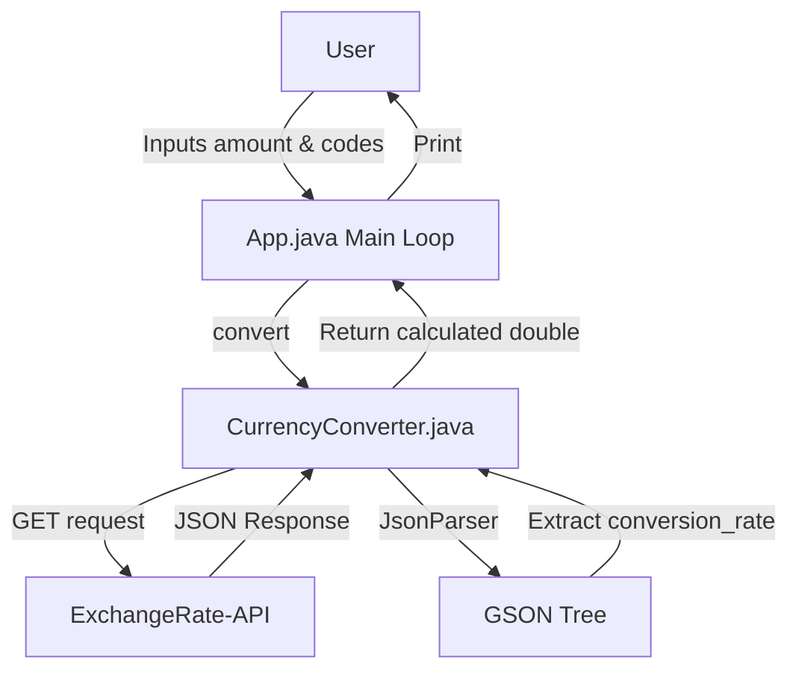

# Developer & Technical Documentation

This document provides a technical guide to the **CurrencyConverter** application's architecture and execution.

---

## System Architecture

The application is structured as a standard Java CLI that delegates logic to a `CurrencyConverter` service class, utilizing GSON for parsing API payloads.



---

## Directory Structure & File Roles

```
.
├── pom.xml                                  # Maven project definition & GSON dependency
├── src/main/java/com/example/App.java       # CLI loops, Switch cases, and Currency List array
├── src/main/java/com/example/CurrencyConverter.java # HTTP networking, Env variable handling, and JSON logic
├── README.md                                # General overview
└── Documentation.md                         # Technical documentation
```

---

## Workflow

The execution flow of CurrencyConverter:
1. **Initialization**: `App.java` defines a constant `List<String>` of fiat codes, metals, and cryptocurrencies. It initiates a `while(true)` CLI loop.
2. **Formatting**: If the user checks currencies, `java.util.Currency.getInstance` maps the ISO codes to human-readable display names, while a static Map overrides and resolves cryptocurrencies not found natively in Java.
3. **Processing**: The user inputs conversion parameters. `CurrencyConverter.getConversionRate` builds the URI using `System.getenv("EXCHANGERATE-API-KEY")`, opens an `HttpURLConnection`, and streams the response directly into `JsonParser.parseReader`.
4. **Output Generation**: The `conversion_rate` is extracted as a double, multiplied by the user's input amount, and printed to `System.out`.

---

## Launcher Compilation Guide

If you need to compile or run the CurrencyConverter executable, utilize Apache Maven.

### Compilation or Execution Commands

Execute the following commands in order within your terminal:

```powershell
# Resolve dependencies and compile the package
mvn clean package

# Run the compiled jar (assuming the jar plugin is configured for Main-Class)
java -cp target/currency-converter-1.0-SNAPSHOT.jar com.example.App
```
